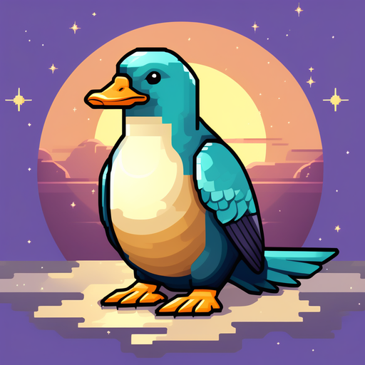

<div align='center'>
   <h1>🤗 KoSOLAR-v0.2-gugutypus-10.7B ☀️</h1>
</div>

<div align='center'>
    <a href="https://huggingface.co/oneonlee/KoSOLAR-v0.2-gugutypus-10.7B"></a>
    <a href="/LICENSE"></a>
    <a href="https://doi.org/10.57967/hf/1735"></a>
  <br>
  <br>
    
</div>

---


## Model Details

**Model Developer**  
- DongGeon Lee [[HuggingFace]](https://huggingface.co/oneonlee) [[GitHub]](https://github.com/oneonlee)

**Model Architecture**  
- **KoSOLAR-v0.2-gugutypus-10.7B** is an instruction fine-tuned auto-regressive language model, based on the [SOLAR](https://huggingface.co/upstage/SOLAR-10.7B-v1.0) transformer architecture.

**Base Model**
- [yanolja/KoSOLAR-10.7B-v0.2](https://huggingface.co/yanolja/KoSOLAR-10.7B-v0.2)

**Training Dataset**
- [kyujinpy/KOR-gugugu-platypus-set](https://huggingface.co/datasets/kyujinpy/KOR-gugugu-platypus-set)


---  


## Model Performances

- **Ko-LLM leaderboard (YYYY/MM/DD)** [[link]](https://huggingface.co/spaces/upstage/open-ko-llm-leaderboard)

| Model                 | Average | Ko-ARC | Ko-HellaSwag | Ko-MMLU | Ko-TruthfulQA | Ko-CommonGen V2 |
| --------------------- | ------- | ------ | ------------ | ------- | ------------- | --------------- |
| **KoSOLAR-gugutypus** | NaN     | NaN    | NaN          | NaN     | NaN           | NaN             |

<br>

- **(KOR) AI-Harness evaluation** [[link]](https://github.com/Beomi/ko-lm-evaluation-harness)  


|          Tasks          |Version|Filter|n-shot|Metric|Value |   |Stderr|
|-------------------------|-------|------|-----:|------|-----:|---|-----:|
|KMMLU                    |N/A    |none  |     0|acc   |0.3335|±  |0.0475|
|KMMLU                    |N/A    |none  |     5|acc   |      |±  |      |
|KoBEST-HellaSwag         |      0|none  |     0|acc   |0.4360|±  |0.0222|
|KoBEST-HellaSwag         |      0|none  |     5|acc   |0.4420|±  |0.0222|
|KoBEST-BoolQ             |      0|none  |     0|acc   |0.5064|±  |0.0133|
|KoBEST-BoolQ             |      0|none  |     5|acc   |0.8583|±  |0.0093|
|KoBEST-COPA              |      0|none  |     0|acc   |0.6040|±  |0.0155|
|KoBEST-COPA              |      0|none  |     5|acc   |0.7610|±  |0.0135|
|KoBEST-SentiNeg          |      0|none  |     0|acc   |0.5844|±  |0.0248|
|KoBEST-SentiNeg          |      0|none  |     5|acc   |0.9471|±  |0.0112|

<br>

- **(ENG) AI-Harness evaluation** [[link]](https://github.com/EleutherAI/lm-evaluation-harness)

|      Tasks      |Version|Filter|n-shot|Metric|Value |   |Stderr|
|------------------|-------|------|-----:|------|-----:|---|-----:|
|MMLU              |N/A    |none  |     0|acc   |0.5826|±  |0.1432|
|MMLU              |N/A    |none  |     5|acc   |0.5885|±  |0.1285|
|HellaSwag         |      1|none  |     0|acc   |0.6075|±  |0.0049|
|HellaSwag         |      1|none  |     5|acc   |0.6098|±  |0.0049|
|BoolQ             |      2|none  |     0|acc   |0.8737|±  |0.0058|
|BoolQ             |      2|none  |     5|acc   |0.8826|±  |0.0056|
|COPA              |      1|none  |     0|acc   |0.8300|±  |0.0378|
|COPA              |      1|none  |     5|acc   |0.9100|±  |0.0288|
|truthfulqa        |N/A    |none  |     0|acc   |0.4249|±  |0.0023|
|truthfulqa        |N/A    |none  |     5|acc   |  -   |±  |   -  |
  
---


## How to Use

```python
### KoSOLAR-gugutypus
from transformers import AutoModelForCausalLM, AutoTokenizer
import torch

repo = "oneonlee/KoSOLAR-v0.2-gugutypus-10.7B"
model = AutoModelForCausalLM.from_pretrained(
        repo,
        return_dict=True,
        torch_dtype=torch.float16,
        device_map='auto'
)
tokenizer = AutoTokenizer.from_pretrained(repo)
```

---

## Citation
```
@misc {donggeon_lee_2024,
	author       = { {DongGeon Lee} },
	title        = { KoSOLAR-v0.2-gugutypus-10.7B (Revision 56841d5) },
	year         = 2024,
	url          = { https://huggingface.co/oneonlee/KoSOLAR-v0.2-gugutypus-10.7B },
	doi          = { 10.57967/hf/1735 },
	publisher    = { Hugging Face }
}
```

---

## References
- [yanolja/KoSOLAR-10.7B-v0.2](https://huggingface.co/yanolja/KoSOLAR-10.7B-v0.2)
- [upstage/SOLAR-10.7B-v1.0](https://huggingface.co/upstage/SOLAR-10.7B-v1.0)
- [kyujinpy/KOR-gugugu-platypus-set](https://huggingface.co/datasets/kyujinpy/KOR-gugugu-platypus-set)
- [squarelike/OpenOrca-gugugo-ko](https://huggingface.co/datasets/squarelike/OpenOrca-gugugo-ko)
- [kyujinpy/KOR-OpenOrca-Platypus-v3](https://huggingface.co/datasets/kyujinpy/KOR-OpenOrca-Platypus-v3)
- [Open-Orca/OpenOrca](https://huggingface.co/datasets/Open-Orca/OpenOrca)
- [upstage/open-ko-llm-leaderboard](https://huggingface.co/spaces/upstage/open-ko-llm-leaderboard)
- [EleutherAI/lm-evaluation-harness](https://github.com/EleutherAI/lm-evaluation-harness)
- [Beomi/ko-lm-evaluation-harness](https://github.com/Beomi/ko-lm-evaluation-harness)
